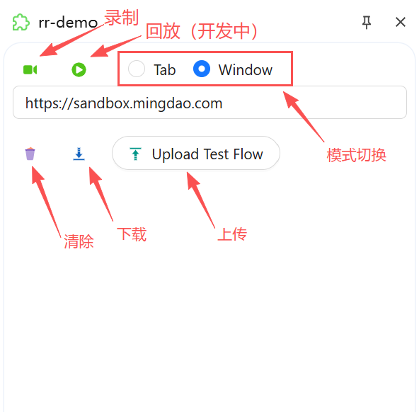

# RR-Tool

This is my first project developing a browser extension; it’s a tool for automated testing  
这是我的第一个浏览器扩展开发项目，它是一个用于自动化测试的工具

## 简介

RR-Tool 支持在页面上录制用户操作并生成可回放的测试流程（TestFlow）。
支持的录制类型：点击、输入、键盘特殊按键、滚轮滚动、拖拽。
<video controls src="assets/video.mp4" title="Title"></video>

## 如何开始 how to start

```
# 进入项目目录
npm install
# pnpm install
npm run dev
# pnpm dev
```

如果想要在自己的浏览器中运行，将.output文件夹加入浏览器扩展中

## 功能特性

- 录制：捕获点击、输入、键盘、滚轮、拖拽等操作并生成步骤（StepInfo）。
- 高亮：录制时高亮当前目标元素，辅助选择与调试。
- 侧边面板：展示录制步骤、查看截图、导入/导出 TestFlow。
- 回放（开发中）：将 TestFlow 转换为实际操作在页面执行（回放功能进行中）。

## 项目结构

```
entrypoints/
  background/             # 后台逻辑、标签窗口管理、注入、调试器 attach、与 sidepanel/content 交互
    browserController.ts
    index.ts
    recorder/
      recorder.ts         # 录制处理（合并步骤、生成 TestFlow、下载、截图）
      screenshot.ts
    replay/                # 回放相关（开发中）
      replayer.ts
      stepAction.ts
      stepLocator.ts
      wait.ts
  recorder.content/       # 注入到被录制页面的内容脚本：构建 StepInfo 并发回 background
    elementAction.ts
    elementSelector.ts
    highlighter.ts
    index.ts
    recorder.ts
    stepBuilder.ts
    ui.tsx
    utils.ts
  highlighter.content/    # 高亮功能的内容脚本入口
    index.ts
  popup/                  # 浏览器工具栏弹出页（小面板）
    index.html
    index.tsx
    popup.css
  sidepanel/              # 侧边控制面板（主要控制面板）
    hooks.ts              # StepsProvider / useSteps 自定义 Hook
    index.html
    panel.css
    sidepanel.tsx
  ui.content/             # 页面内 UI（开发中）
    index.tsx
    ui.css
src/
  messaging.ts            # 扩展内统一消息封装（sendMessage / onMessage）
  template.ts             # 共享类型定义（StepInfo、Locator、TestFlow、等）
```

## 使用的主要框架与库

- 开发框架：wxt
- 消息处理：@webext-core/messaging
- 前端：React + antd

## Recorder 部分（完善中）

1. Window 录制模式  
   - 打开新窗口并录制该窗口中所有标签页的操作。
2. Tab 录制模式  
   - 仅录制当前标签页的操作。

## Replay 部分（开发中）

## 控制侧板


## 后续开发计划

- 完善录制功能
- 开发回放部分
- 录制和回放的页面ui
- 集成到TestAutomation中

## 备注

- replay（回放）模块尚在开发中。  